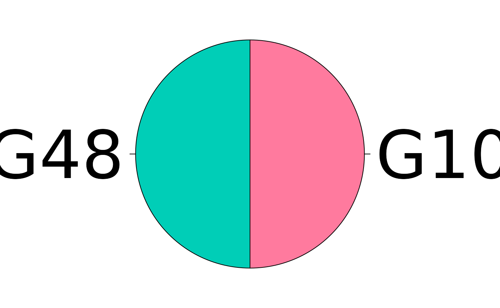

# categoryCompare2: visNetwork

## categoryCompare2: Alternative Visualization

Authored by: **Robert M Flight** `<rflight79@gmail.com>` on 2026-04-30
18:32:38.732368

### Introduction

Current high-throughput molecular biology experiments are generating
larger and larger amounts of data. Although there are many different
methods to analyze individual experiments, methods that allow the
comparison of different data sets are sorely lacking. This is important
due to the number of experiments that have been carried out on
biological systems that may be amenable to either fusion or comparison.
Most of the current tools available focus on finding those genes in
experiments that are listed as the same, or that can be shown
statistically that it is significant that the gene was listed in the
results of both experiments.

However, what many of these tools do not do is consider the similarities
(and just as importantly, the differences) between experimental results
at the categorical level. Categoical data includes any gene annotation,
such as Gene Ontologies, KEGG pathways, chromosome location, etc.
categoryCompare has been developed to allow the comparison of
high-throughput experiments at a categorical level, and to explore those
results in an intuitive fashion.

### Sample Data

To make the concept more concrete, we will examine data from the
microarray data set `estrogen` available from Bioconductor. This data
set contains 8 samples, with 2 levels of estrogen therapy (present vs
absent), and two time points (10 and 48 hours). A pre-processed version
of the data is available with this package, the commands used to
generate it are below. Note: the preprocessed one keeps only the top 100
genes, if you use it the results will be slightly different than those
shown in the vignette.

``` r

library("affy")
library("hgu95av2.db")
library("genefilter")
library("estrogen")
library("limma")
```

``` r

datadir <- system.file("extdata", package = "estrogen")
pd <- read.AnnotatedDataFrame(
  file.path(datadir, "estrogen.txt"),
  header = TRUE,
  sep = "",
  row.names = 1
)
pData(pd)
```

Here you can see the descriptions for each of the arrays. First, we will
read in the cel files, and then normalize the data using RMA.

``` r

currDir <- getwd()
setwd(datadir)
a <- ReadAffy(filenames = rownames(pData(pd)), phenoData = pd, verbose = TRUE)
setwd(currDir)
```

``` r

eData <- rma(a)
```

To make it easier to conceptualize, we will split the data up into two
eSet objects by time, and perform all of the manipulations for
calculating significantly differentially expressed genes on each eSet
object.

So for the 10 hour samples:

``` r

e_file <- system.file(
  "extdata/test_data/estrogen_edata.rds",
  package = "categoryCompare2"
)
eData <- readRDS(e_file)
e10 <- eData[, eData$time.h == 10]
e10 <- nsFilter(
  e10,
  remove.dupEntrez = TRUE,
  var.filter = FALSE,
  feature.exclude = "^AFFX"
)$eset

e10$estrogen <- factor(e10$estrogen)
d10 <- model.matrix(~ 0 + e10$estrogen)
colnames(d10) <- unique(e10$estrogen)
fit10 <- lmFit(e10, d10)
c10 <- makeContrasts(present - absent, levels = d10)
fit10_2 <- contrasts.fit(fit10, c10)
eB10 <- eBayes(fit10_2)
table10 <- topTable(eB10, number = nrow(e10), p.value = 1, adjust.method = "BH")
table10$Entrez <- unlist(mget(
  rownames(table10),
  hgu95av2ENTREZID,
  ifnotfound = NA
))
```

And the 48 hour samples we do the same thing:

``` r

e48 <- eData[, eData$time.h == 48]
e48 <- nsFilter(
  e48,
  remove.dupEntrez = TRUE,
  var.filter = FALSE,
  feature.exclude = "^AFFX"
)$eset

e48$estrogen <- factor(e48$estrogen)
d48 <- model.matrix(~ 0 + e48$estrogen)
colnames(d48) <- unique(e48$estrogen)
fit48 <- lmFit(e48, d48)
c48 <- makeContrasts(present - absent, levels = d48)
fit48_2 <- contrasts.fit(fit48, c48)
eB48 <- eBayes(fit48_2)
table48 <- topTable(eB48, number = nrow(e48), p.value = 1, adjust.method = "BH")
table48$Entrez <- unlist(mget(
  rownames(table48),
  hgu95av2ENTREZID,
  ifnotfound = NA
))
```

And grab all the genes on the array to have a background set.

``` r

gUniverse <- unique(union(table10$Entrez, table48$Entrez))
```

For both time points we have generated a list of genes that are
differentially expressed in the present vs absent samples. To compare
the time-points, we could find the common and discordant genes from both
experiments, and then try to interpret those lists. This is commonly
done in many meta-analysis studies that attempt to combine the results
of many different experiments.

An alternative approach, used in `categoryCompare`, would be to compare
the significantly enriched categories from the two gene lists. Currently
the package supports two category classes, Gene Ontology, and KEGG
pathways. Both are used below.

Note 1: I am not proposing that this is the best way to analyse *this*
particular data, it is a sample data set that merely serves to
illustrate the functionality of this package. However, there are many
different experiments where this type of approach is definitely
appropriate, and it is up to the user to determine if their data fits
the analytical paradigm advocated here.

### Create Gene List

``` r

library("categoryCompare2")
library("GO.db")
library("org.Hs.eg.db")

g10 <- unique(table10$Entrez[table10$adj.P.Val < 0.05])
g48 <- unique(table48$Entrez[table48$adj.P.Val < 0.05])
```

### Create GO Annotation Object

Before we can do our analysis, we need to define the `annotation`
object, which maps the annotations to the features (genes in this case).
For a Gene Ontology (GO) based analysis, this would be **all** the genes
annotated to a particular GO term based on inheritance in the GO DAG. We
can generate this list using the `GOALL` column of the `org.Hs.eg.db`,
and then filter to the terms of interest, or use them all.

``` r

go_all_gene <- AnnotationDbi::select(
  org.Hs.eg.db,
  keys = gUniverse,
  columns = c("GOALL", "ONTOLOGYALL")
)
```

    ## 'select()' returned 1:many mapping between keys and columns

``` r

go_all_gene <- go_all_gene[go_all_gene$ONTOLOGYALL == "BP", ]
bp_2_gene <- split(go_all_gene$ENTREZID, go_all_gene$GOALL)

bp_2_gene <- lapply(bp_2_gene, unique)
bp_desc <- AnnotationDbi::select(
  GO.db,
  keys = names(bp_2_gene),
  columns = "TERM",
  keytype = "GOID"
)$TERM
```

    ## 'select()' returned 1:1 mapping between keys and columns

``` r

names(bp_desc) <- names(bp_2_gene)

bp_annotation <- categoryCompare2::annotation(
  annotation_features = bp_2_gene,
  description = bp_desc,
  annotation_type = "GO.BP"
)
```

### Do Enrichment

Now we can do hypergeometric enrichment with each of the gene lists.

``` r

g10_enrich <- hypergeometric_feature_enrichment(
  new(
    "hypergeometric_features",
    significant = g10,
    universe = gUniverse,
    annotation = bp_annotation
  ),
  p_adjust = "BH"
)

g48_enrich <- hypergeometric_feature_enrichment(
  new(
    "hypergeometric_features",
    significant = g48,
    universe = gUniverse,
    annotation = bp_annotation
  ),
  p_adjust = "BH"
)
```

### Combine and Find Significant

``` r

bp_combined <- combine_enrichments(g10 = g10_enrich, g48 = g48_enrich)
```

``` r

bp_sig <- get_significant_annotations(
  bp_combined,
  padjust <= 0.001,
  counts >= 2
)
bp_sig@statistics@significant
```

    ## Signficance Cutoffs:
    ##   ~padjust <= 0.001
    ##   ~counts >= 2
    ## 
    ## Counts:
    ##    g10 g48 counts
    ## G1   1   1     60
    ## G2   1   0     38
    ## G3   0   1     49
    ## G4   0   0  13764

### Generate Graph

``` r

bp_graph <- generate_annotation_graph(bp_sig)
bp_graph
```

    ## A cc_graph with
    ## Number of Nodes = 123 
    ## Number of Edges = 6793 
    ##    g10 g48 counts
    ## G1   1   1     53
    ## G2   1   0     24
    ## G3   0   1     46

``` r

bp_graph <- remove_edges(bp_graph, 0.8)
```

    ## Removed 6593 edges from graph

``` r

bp_graph
```

    ## A cc_graph with
    ## Number of Nodes = 123 
    ## Number of Edges = 200 
    ##    g10 g48 counts
    ## G1   1   1     53
    ## G2   1   0     24
    ## G3   0   1     46

``` r

bp_assign <- annotation_combinations(bp_graph)
bp_assign <- assign_colors(bp_assign)
```

### visNetwork Visualization

We can use the `DiagrammeR` and `visNetwork` html widgets to create
interactive visualizations either in the `RStudio` viewer, or as panes
in the html report.

#### Find Communities

It is useful to define the annotations in terms of their
**communities**. To do this we run methods that find and then label the
communities, before generating the visualization and table.

``` r

bp_communities <- assign_communities(bp_graph)
bp_comm_labels <- label_communities(bp_communities, bp_annotation)
```

#### Create Stats Table

To provide a list of which GO terms are in each of the communities we
found, lets generate a table, with the community labels so it makes it
easier to find them in the graph if desired.

``` r

bp_table <- table_from_graph(bp_graph, bp_assign, bp_comm_labels)
knitr::kable(bp_table)
```

| name | description | sig_group | g10.p | g10.odds | g10.expected | g10.counts | g10.padjust | g10.significant | g48.p | g48.odds | g48.expected | g48.counts | g48.padjust | g48.significant | group |
|:---|:---|:---|---:|---:|---:|---:|---:|---:|---:|---:|---:|---:|---:|---:|---:|
|  | **spindle organization** |  | NA | NA | NA | NA | NA | NA | NA | NA | NA | NA | NA | NA | 1 |
| <GO:0007051> | spindle organization | g10,g48 | 0.0000070 | 3.027139 | 10.2303351 | 26 | 0.0009908 | 687 | 0.0000000 | 11.185374 | 1.4593491 | 13 | 0.0000005 | 98 | 1 |
| <GO:0007052> | mitotic spindle organization | g48 | 0.0000397 | 3.314717 | 6.9302270 | 19 | 0.0040651 | 687 | 0.0000000 | 12.523034 | 0.9885913 | 10 | 0.0000084 | 98 | 1 |
| <GO:0051225> | spindle assembly | g48 | 0.0017651 | 2.642299 | 6.5177135 | 15 | 0.0919640 | 687 | 0.0000003 | 11.786677 | 0.9297466 | 9 | 0.0000510 | 98 | 1 |
| <GO:1902850> | microtubule cytoskeleton organization involved in mitosis | g48 | 0.0000356 | 3.012121 | 8.6627837 | 22 | 0.0037207 | 687 | 0.0000000 | 12.207052 | 1.2357392 | 12 | 0.0000007 | 98 | 1 |
|  | **cell cycle phase transition** |  | NA | NA | NA | NA | NA | NA | NA | NA | NA | NA | NA | NA | 2 |
| <GO:0007346> | regulation of mitotic cell cycle | g10,g48 | 0.0000000 | 2.727088 | 26.3183620 | 60 | 0.0000002 | 687 | 0.0000000 | 6.356582 | 3.7542933 | 19 | 0.0000010 | 98 | 2 |
| <GO:0044770> | cell cycle phase transition | g10,g48 | 0.0000000 | 3.059389 | 27.8859133 | 69 | 0.0000000 | 687 | 0.0000000 | 8.175245 | 3.9779032 | 24 | 0.0000000 | 98 | 2 |
| <GO:0044772> | mitotic cell cycle phase transition | g10,g48 | 0.0000000 | 3.184457 | 22.5232377 | 58 | 0.0000000 | 687 | 0.0000000 | 9.787573 | 3.2129218 | 23 | 0.0000000 | 98 | 2 |
| <GO:1901987> | regulation of cell cycle phase transition | g10,g48 | 0.0000000 | 3.281417 | 21.6157079 | 57 | 0.0000000 | 687 | 0.0000000 | 7.363217 | 3.0834634 | 18 | 0.0000003 | 98 | 2 |
| <GO:1901990> | regulation of mitotic cell cycle phase transition | g10,g48 | 0.0000000 | 3.488421 | 16.5005404 | 46 | 0.0000000 | 687 | 0.0000000 | 9.227687 | 2.3537889 | 17 | 0.0000001 | 98 | 2 |
|  | **chromosome segregation** |  | NA | NA | NA | NA | NA | NA | NA | NA | NA | NA | NA | NA | 3 |
| <GO:0000070> | mitotic sister chromatid segregation | g10,g48 | 0.0000000 | 4.107415 | 9.4053080 | 30 | 0.0000019 | 687 | 0.0000000 | 16.189149 | 1.3416597 | 16 | 0.0000000 | 98 | 3 |
| <GO:0000819> | sister chromatid segregation | g10,g48 | 0.0000000 | 3.692304 | 11.2203675 | 33 | 0.0000028 | 687 | 0.0000000 | 15.465890 | 1.6005764 | 18 | 0.0000000 | 98 | 3 |
| <GO:0007059> | chromosome segregation | g10,g48 | 0.0000000 | 2.872291 | 18.7281134 | 45 | 0.0000050 | 687 | 0.0000000 | 10.621801 | 2.6715504 | 21 | 0.0000000 | 98 | 3 |
| <GO:0098813> | nuclear chromosome segregation | g10,g48 | 0.0000000 | 3.314335 | 13.6954485 | 37 | 0.0000039 | 687 | 0.0000000 | 15.205016 | 1.9536448 | 21 | 0.0000000 | 98 | 3 |
|  | **cell cycle checkpoint signaling** |  | NA | NA | NA | NA | NA | NA | NA | NA | NA | NA | NA | NA | 4 |
| <GO:0000077> | DNA damage checkpoint signaling | g10 | 0.0000000 | 5.718374 | 5.6926864 | 23 | 0.0000009 | 687 | 0.0012628 | 6.859039 | 0.8120572 | 5 | 0.0825711 | 98 | 4 |
| <GO:0031570> | DNA integrity checkpoint signaling | g10 | 0.0000000 | 6.337570 | 6.2702054 | 27 | 0.0000000 | 687 | 0.0002563 | 7.601553 | 0.8944398 | 6 | 0.0227078 | 98 | 4 |
| <GO:0000075> | cell cycle checkpoint signaling | g10,g48 | 0.0000000 | 6.701797 | 8.8277891 | 39 | 0.0000000 | 687 | 0.0000000 | 14.580645 | 1.2592771 | 14 | 0.0000000 | 98 | 4 |
| <GO:0007093> | mitotic cell cycle checkpoint signaling | g10,g48 | 0.0000000 | 7.975779 | 6.2702054 | 31 | 0.0000000 | 687 | 0.0000000 | 19.824090 | 0.8944398 | 13 | 0.0000000 | 98 | 4 |
|  | **meiotic cell cycle** |  | NA | NA | NA | NA | NA | NA | NA | NA | NA | NA | NA | NA | 5 |
| <GO:0051321> | meiotic cell cycle | g10,g48 | 0.0000010 | 3.097207 | 11.6328810 | 30 | 0.0001882 | 687 | 0.0000000 | 9.679504 | 1.6594212 | 13 | 0.0000020 | 98 | 5 |
| <GO:0007127> | meiosis I | g48 | 0.0001608 | 3.675248 | 4.7026540 | 14 | 0.0127789 | 687 | 0.0000003 | 14.839002 | 0.6708298 | 8 | 0.0000477 | 98 | 5 |
| <GO:0061982> | meiosis I cell cycle process | g48 | 0.0000085 | 4.188773 | 5.1976702 | 17 | 0.0011615 | 687 | 0.0000000 | 15.308989 | 0.7414435 | 9 | 0.0000083 | 98 | 5 |
| <GO:0140013> | meiotic nuclear division | g48 | 0.0009529 | 2.630117 | 7.4252432 | 17 | 0.0554642 | 687 | 0.0000010 | 10.172285 | 1.0592050 | 9 | 0.0001437 | 98 | 5 |
| <GO:1903046> | meiotic cell cycle process | g48 | 0.0000079 | 3.273343 | 8.4977783 | 23 | 0.0010902 | 687 | 0.0000003 | 9.941349 | 1.2122013 | 10 | 0.0000506 | 98 | 5 |
|  | **negative regulation of cell cycle** |  | NA | NA | NA | NA | NA | NA | NA | NA | NA | NA | NA | NA | 6 |
| <GO:0010948> | negative regulation of cell cycle process | g10,g48 | 0.0000000 | 4.177036 | 14.7679837 | 47 | 0.0000000 | 687 | 0.0000000 | 8.887379 | 2.1066410 | 15 | 0.0000005 | 98 | 6 |
| <GO:0045786> | negative regulation of cell cycle | g10,g48 | 0.0000000 | 3.213583 | 19.5531404 | 51 | 0.0000000 | 687 | 0.0000001 | 6.518235 | 2.7892398 | 15 | 0.0000173 | 98 | 6 |
| <GO:1901988> | negative regulation of cell cycle phase transition | g10,g48 | 0.0000000 | 4.838270 | 12.1278972 | 43 | 0.0000000 | 687 | 0.0000000 | 10.145363 | 1.7300348 | 14 | 0.0000004 | 98 | 6 |
|  | **negative regulation of mitotic cell cycle** |  | NA | NA | NA | NA | NA | NA | NA | NA | NA | NA | NA | NA | 7 |
| <GO:0045930> | negative regulation of mitotic cell cycle | g10,g48 | 0.0000000 | 4.426503 | 11.0553621 | 37 | 0.0000000 | 687 | 0.0000000 | 10.248323 | 1.5770385 | 13 | 0.0000011 | 98 | 7 |
| <GO:1901991> | negative regulation of mitotic cell cycle phase transition | g10,g48 | 0.0000000 | 5.110409 | 8.3327729 | 31 | 0.0000000 | 687 | 0.0000000 | 14.148797 | 1.1886634 | 13 | 0.0000001 | 98 | 7 |
|  | **organelle fission** |  | NA | NA | NA | NA | NA | NA | NA | NA | NA | NA | NA | NA | 8 |
| <GO:0000280> | nuclear division | g10,g48 | 0.0000000 | 2.823351 | 20.2956647 | 48 | 0.0000030 | 687 | 0.0000000 | 9.701818 | 2.8951603 | 21 | 0.0000000 | 98 | 8 |
| <GO:0048285> | organelle fission | g10,g48 | 0.0000000 | 2.717261 | 22.2757296 | 51 | 0.0000032 | 687 | 0.0000000 | 8.740416 | 3.1776150 | 21 | 0.0000000 | 98 | 8 |
| <GO:0140014> | mitotic nuclear division | g10,g48 | 0.0000002 | 3.006211 | 14.3554702 | 36 | 0.0000378 | 687 | 0.0000000 | 11.643750 | 2.0477963 | 18 | 0.0000000 | 98 | 8 |
|  | **negative regulation of cell cycle G2/M phase transition** |  | NA | NA | NA | NA | NA | NA | NA | NA | NA | NA | NA | NA | 9 |
| <GO:0010972> | negative regulation of G2/M transition of mitotic cell cycle | g10,g48 | 0.0000013 | 6.336404 | 3.2176054 | 14 | 0.0002276 | 687 | 0.0000003 | 19.704327 | 0.4589888 | 7 | 0.0000477 | 98 | 9 |
| <GO:0044818> | mitotic G2/M transition checkpoint | g10,g48 | 0.0000044 | 6.773333 | 2.6400865 | 12 | 0.0007044 | 687 | 0.0000016 | 20.576087 | 0.3766062 | 6 | 0.0002288 | 98 | 9 |
| <GO:1902750> | negative regulation of cell cycle G2/M phase transition | g10,g48 | 0.0000026 | 5.865500 | 3.3826108 | 14 | 0.0004436 | 687 | 0.0000004 | 18.540724 | 0.4825267 | 7 | 0.0000653 | 98 | 9 |
|  | **chromosome localization** |  | NA | NA | NA | NA | NA | NA | NA | NA | NA | NA | NA | NA | 10 |
| <GO:0007080> | mitotic metaphase chromosome alignment | g48 | 0.0003750 | 4.499261 | 2.8875946 | 10 | 0.0251998 | 687 | 0.0000001 | 22.530220 | 0.4119131 | 7 | 0.0000237 | 98 | 10 |
| <GO:0050000> | chromosome localization | g48 | 0.0003400 | 3.195334 | 5.6101837 | 15 | 0.0233007 | 687 | 0.0000011 | 12.102222 | 0.8002882 | 8 | 0.0001670 | 98 | 10 |
| <GO:0051310> | metaphase chromosome alignment | g48 | 0.0000317 | 4.137086 | 4.6201513 | 15 | 0.0034137 | 687 | 0.0000002 | 15.150000 | 0.6590609 | 8 | 0.0000428 | 98 | 10 |
|  | **cell cycle G2/M phase transition** |  | NA | NA | NA | NA | NA | NA | NA | NA | NA | NA | NA | NA | 11 |
| <GO:0000086> | G2/M transition of mitotic cell cycle | g10,g48 | 0.0000002 | 4.091578 | 7.5077459 | 24 | 0.0000413 | 687 | 0.0000000 | 17.645022 | 1.0709739 | 14 | 0.0000000 | 98 | 11 |
| <GO:0010389> | regulation of G2/M transition of mitotic cell cycle | g10,g48 | 0.0000001 | 5.060803 | 5.3626756 | 20 | 0.0000295 | 687 | 0.0000000 | 16.888430 | 0.7649814 | 10 | 0.0000008 | 98 | 11 |
| <GO:0044839> | cell cycle G2/M phase transition | g10,g48 | 0.0000001 | 3.914802 | 8.4152756 | 26 | 0.0000292 | 687 | 0.0000000 | 16.913170 | 1.2004323 | 15 | 0.0000000 | 98 | 11 |
| <GO:1902749> | regulation of cell cycle G2/M phase transition | g10,g48 | 0.0000008 | 4.375505 | 5.9401945 | 20 | 0.0001587 | 687 | 0.0000000 | 14.968842 | 0.8473640 | 10 | 0.0000022 | 98 | 11 |
|  | **chromosome separation** |  | NA | NA | NA | NA | NA | NA | NA | NA | NA | NA | NA | NA | 12 |
| <GO:0007094> | mitotic spindle assembly checkpoint signaling | g10,g48 | 0.0000065 | 7.296641 | 2.3100757 | 11 | 0.0009293 | 687 | 0.0000000 | 36.484444 | 0.3295304 | 8 | 0.0000002 | 98 | 12 |
| <GO:0010965> | regulation of mitotic sister chromatid separation | g10,g48 | 0.0000041 | 6.120673 | 3.0526000 | 13 | 0.0006714 | 687 | 0.0000000 | 34.520202 | 0.4354509 | 10 | 0.0000000 | 98 | 12 |
| <GO:0031577> | spindle checkpoint signaling | g10,g48 | 0.0000065 | 7.296641 | 2.3100757 | 11 | 0.0009293 | 687 | 0.0000000 | 36.484444 | 0.3295304 | 8 | 0.0000002 | 98 | 12 |
| <GO:0051784> | negative regulation of nuclear division | g10,g48 | 0.0000057 | 5.875074 | 3.1351027 | 13 | 0.0008622 | 687 | 0.0000000 | 24.293333 | 0.4472199 | 8 | 0.0000023 | 98 | 12 |
| <GO:0071173> | spindle assembly checkpoint signaling | g10,g48 | 0.0000065 | 7.296641 | 2.3100757 | 11 | 0.0009293 | 687 | 0.0000000 | 36.484444 | 0.3295304 | 8 | 0.0000002 | 98 | 12 |
| <GO:0071174> | mitotic spindle checkpoint signaling | g10,g48 | 0.0000065 | 7.296641 | 2.3100757 | 11 | 0.0009293 | 687 | 0.0000000 | 36.484444 | 0.3295304 | 8 | 0.0000002 | 98 | 12 |
| <GO:0033046> | negative regulation of sister chromatid segregation | g48 | 0.0000097 | 6.890368 | 2.3925784 | 11 | 0.0012689 | 687 | 0.0000000 | 34.742857 | 0.3412994 | 8 | 0.0000003 | 98 | 12 |
| <GO:0033047> | regulation of mitotic sister chromatid segregation | g48 | 0.0000128 | 5.887536 | 2.8875946 | 12 | 0.0016295 | 687 | 0.0000000 | 31.904494 | 0.4119131 | 9 | 0.0000001 | 98 | 12 |
| <GO:0033048> | negative regulation of mitotic sister chromatid segregation | g48 | 0.0000097 | 6.890368 | 2.3925784 | 11 | 0.0012689 | 687 | 0.0000000 | 34.742857 | 0.3412994 | 8 | 0.0000003 | 98 | 12 |
| <GO:0045839> | negative regulation of mitotic nuclear division | g48 | 0.0000128 | 5.887536 | 2.8875946 | 12 | 0.0016295 | 687 | 0.0000000 | 27.002469 | 0.4119131 | 8 | 0.0000012 | 98 | 12 |
| <GO:0045841> | negative regulation of mitotic metaphase/anaphase transition | g48 | 0.0000097 | 6.890368 | 2.3925784 | 11 | 0.0012689 | 687 | 0.0000000 | 34.742857 | 0.3412994 | 8 | 0.0000003 | 98 | 12 |
| <GO:0051304> | chromosome separation | g48 | 0.0000430 | 4.274607 | 4.2076378 | 14 | 0.0043659 | 687 | 0.0000000 | 22.694013 | 0.6002162 | 10 | 0.0000001 | 98 | 12 |
| <GO:0051306> | mitotic sister chromatid separation | g48 | 0.0000079 | 5.648368 | 3.2176054 | 13 | 0.0010902 | 687 | 0.0000000 | 32.131661 | 0.4589888 | 10 | 0.0000000 | 98 | 12 |
| <GO:0051985> | negative regulation of chromosome segregation | g48 | 0.0000141 | 6.526861 | 2.4750811 | 11 | 0.0017406 | 687 | 0.0000000 | 33.159596 | 0.3530683 | 8 | 0.0000004 | 98 | 12 |
| <GO:1902100> | negative regulation of metaphase/anaphase transition of cell cycle | g48 | 0.0000141 | 6.526861 | 2.4750811 | 11 | 0.0017406 | 687 | 0.0000000 | 33.159596 | 0.3530683 | 8 | 0.0000004 | 98 | 12 |
| <GO:1905818> | regulation of chromosome separation | g48 | 0.0000203 | 4.653614 | 3.9601297 | 14 | 0.0023476 | 687 | 0.0000000 | 24.494617 | 0.5649093 | 10 | 0.0000001 | 98 | 12 |
| <GO:1905819> | negative regulation of chromosome separation | g48 | 0.0000141 | 6.526861 | 2.4750811 | 11 | 0.0017406 | 687 | 0.0000000 | 33.159596 | 0.3530683 | 8 | 0.0000004 | 98 | 12 |
| <GO:2000816> | negative regulation of mitotic sister chromatid separation | g48 | 0.0000097 | 6.890368 | 2.3925784 | 11 | 0.0012689 | 687 | 0.0000000 | 34.742857 | 0.3412994 | 8 | 0.0000003 | 98 | 12 |
|  | **regulation of chromosome segregation** |  | NA | NA | NA | NA | NA | NA | NA | NA | NA | NA | NA | NA | 13 |
| <GO:0007091> | metaphase/anaphase transition of mitotic cell cycle | g48 | 0.0000397 | 4.038053 | 4.7026540 | 15 | 0.0040651 | 687 | 0.0000000 | 22.492004 | 0.6708298 | 11 | 0.0000000 | 98 | 13 |
| <GO:0030071> | regulation of mitotic metaphase/anaphase transition | g48 | 0.0000317 | 4.137086 | 4.6201513 | 15 | 0.0034137 | 687 | 0.0000000 | 22.994636 | 0.6590609 | 11 | 0.0000000 | 98 | 13 |
| <GO:0033045> | regulation of sister chromatid segregation | g48 | 0.0000440 | 3.771485 | 5.2801729 | 16 | 0.0044352 | 687 | 0.0000000 | 21.941861 | 0.7532124 | 12 | 0.0000000 | 98 | 13 |
| <GO:0044784> | metaphase/anaphase transition of cell cycle | g48 | 0.0000496 | 3.943625 | 4.7851567 | 15 | 0.0047576 | 687 | 0.0000000 | 22.010761 | 0.6825988 | 11 | 0.0000000 | 98 | 13 |
| <GO:0051983> | regulation of chromosome segregation | g48 | 0.0001630 | 3.152508 | 6.4352108 | 17 | 0.0128811 | 687 | 0.0000000 | 19.209412 | 0.9179777 | 13 | 0.0000000 | 98 | 13 |
| <GO:1902099> | regulation of metaphase/anaphase transition of cell cycle | g48 | 0.0000397 | 4.038053 | 4.7026540 | 15 | 0.0040651 | 687 | 0.0000000 | 22.492004 | 0.6708298 | 11 | 0.0000000 | 98 | 13 |
|  | **regulation of DNA biosynthetic process** |  | NA | NA | NA | NA | NA | NA | NA | NA | NA | NA | NA | NA | 14 |
| <GO:2000278> | regulation of DNA biosynthetic process | g10 | 0.0000002 | 5.271688 | 4.9501621 | 19 | 0.0000360 | 687 | 0.0053152 | 6.210486 | 0.7061367 | 4 | 0.2464644 | 98 | 14 |
| <GO:2000573> | positive regulation of DNA biosynthetic process | g10 | 0.0000000 | 9.084948 | 2.9700973 | 16 | 0.0000018 | 687 | 0.0667043 | 5.021446 | 0.4236820 | 2 | 1.0000000 | 98 | 14 |
|  | **positive regulation of chromosome separation** |  | NA | NA | NA | NA | NA | NA | NA | NA | NA | NA | NA | NA | 15 |
| <GO:1901970> | positive regulation of mitotic sister chromatid separation | g48 | 0.0179681 | 4.965674 | 1.0725351 | 4 | 0.4679284 | 687 | 0.0000002 | 55.248656 | 0.1529963 | 5 | 0.0000428 | 98 | 15 |
| <GO:1905820> | positive regulation of chromosome separation | g48 | 0.0252188 | 3.493402 | 1.7325567 | 5 | 0.5672621 | 687 | 0.0000036 | 27.597446 | 0.2471478 | 5 | 0.0004870 | 98 | 15 |
|  | **recombinational repair** |  | NA | NA | NA | NA | NA | NA | NA | NA | NA | NA | NA | NA | 16 |
| <GO:0000724> | double-strand break repair via homologous recombination | g10,g48 | 0.0000000 | 4.484967 | 8.8277891 | 30 | 0.0000004 | 687 | 0.0000004 | 9.526710 | 1.2592771 | 10 | 0.0000693 | 98 | 16 |
| <GO:0000725> | recombinational repair | g10,g48 | 0.0000000 | 4.581418 | 8.9927945 | 31 | 0.0000002 | 687 | 0.0000005 | 9.331956 | 1.2828149 | 10 | 0.0000797 | 98 | 16 |
|  | **DNA replication** |  | NA | NA | NA | NA | NA | NA | NA | NA | NA | NA | NA | NA | 17 |
| <GO:0006260> | DNA replication | g10,g48 | 0.0000000 | 6.904838 | 14.5204756 | 64 | 0.0000000 | 687 | 0.0000000 | 10.652225 | 2.0713342 | 17 | 0.0000000 | 98 | 17 |
| <GO:0006261> | DNA-templated DNA replication | g10,g48 | 0.0000000 | 9.333025 | 8.9927945 | 48 | 0.0000000 | 687 | 0.0000001 | 10.490382 | 1.2828149 | 11 | 0.0000097 | 98 | 17 |
|  | **regulation of nuclear division** |  | NA | NA | NA | NA | NA | NA | NA | NA | NA | NA | NA | NA | 18 |
| <GO:0007088> | regulation of mitotic nuclear division | g48 | 0.0002256 | 3.051623 | 6.6002162 | 17 | 0.0168703 | 687 | 0.0000000 | 14.952524 | 0.9415156 | 11 | 0.0000005 | 98 | 18 |
| <GO:0051783> | regulation of nuclear division | g48 | 0.0008491 | 2.575126 | 8.0027621 | 18 | 0.0496320 | 687 | 0.0000000 | 11.971799 | 1.1415876 | 11 | 0.0000032 | 98 | 18 |
|  | **regulation of DNA metabolic process** |  | NA | NA | NA | NA | NA | NA | NA | NA | NA | NA | NA | NA | 19 |
| <GO:0051054> | positive regulation of DNA metabolic process | g10 | 0.0000000 | 3.413823 | 15.2629999 | 42 | 0.0000003 | 687 | 0.0060259 | 3.479257 | 2.1772547 | 7 | 0.2636052 | 98 | 19 |
| <GO:0051052> | regulation of DNA metabolic process | g10,g48 | 0.0000000 | 2.876259 | 25.2458268 | 60 | 0.0000001 | 687 | 0.0000005 | 5.341632 | 3.6012970 | 16 | 0.0000723 | 98 | 19 |
|  | **positive regulation of ubiquitin-protein transferase activity** |  | NA | NA | NA | NA | NA | NA | NA | NA | NA | NA | NA | NA | 20 |
| <GO:0051443> | positive regulation of ubiquitin-protein transferase activity | g48 | 0.1365378 | 3.714842 | 0.6600216 | 2 | 1.0000000 | 687 | 0.0000012 | 87.500000 | 0.0941516 | 4 | 0.0001747 | 98 | 20 |
| <GO:1904668> | positive regulation of ubiquitin protein ligase activity | g48 | 0.0815704 | 5.573723 | 0.4950162 | 2 | 0.9188912 | 687 | 0.0000003 | 175.042553 | 0.0706137 | 4 | 0.0000456 | 98 | 20 |
|  | **meiotic chromosome segregation** |  | NA | NA | NA | NA | NA | NA | NA | NA | NA | NA | NA | NA | 21 |
| <GO:0045132> | meiotic chromosome segregation | g48 | 0.0044778 | 3.258207 | 3.3001081 | 9 | 0.1837478 | 687 | 0.0000003 | 19.104895 | 0.4707578 | 7 | 0.0000553 | 98 | 21 |
| <GO:0045143> | homologous chromosome segregation | g48 | 0.0114429 | 3.730788 | 1.9800648 | 6 | 0.3553170 | 687 | 0.0000073 | 23.231466 | 0.2824547 | 5 | 0.0009257 | 98 | 21 |
|  | **telomere organization** |  | NA | NA | NA | NA | NA | NA | NA | NA | NA | NA | NA | NA | 22 |
| <GO:0000723> | telomere maintenance | g10 | 0.0000000 | 5.283315 | 8.4152756 | 32 | 0.0000000 | 687 | 0.0069056 | 4.507261 | 1.2004323 | 5 | 0.2946732 | 98 | 22 |
| <GO:0032200> | telomere organization | g10 | 0.0000000 | 5.503759 | 9.2403026 | 36 | 0.0000000 | 687 | 0.0019975 | 4.997744 | 1.3181218 | 6 | 0.1129586 | 98 | 22 |
|  | **mitotic DNA integrity checkpoint signaling** |  | NA | NA | NA | NA | NA | NA | NA | NA | NA | NA | NA | NA | 23 |
| <GO:0044773> | mitotic DNA damage checkpoint signaling | g10 | 0.0000001 | 7.263189 | 3.3826108 | 16 | 0.0000137 | 687 | 0.0013084 | 9.421507 | 0.4825267 | 4 | 0.0825711 | 98 | 23 |
| <GO:0044774> | mitotic DNA integrity checkpoint signaling | g10 | 0.0000000 | 7.154284 | 3.6301189 | 17 | 0.0000065 | 687 | 0.0001538 | 11.290323 | 0.5178336 | 5 | 0.0144605 | 98 | 23 |
|  | **positive regulation of chromosome organization** |  | NA | NA | NA | NA | NA | NA | NA | NA | NA | NA | NA | NA | 24 |
| <GO:0032206> | positive regulation of telomere maintenance | g10 | 0.0000053 | 4.993435 | 4.0426324 | 15 | 0.0008188 | 687 | 0.4411013 | 1.757088 | 0.5766783 | 1 | 1.0000000 | 98 | 24 |
| <GO:2001252> | positive regulation of chromosome organization | g10 | 0.0000008 | 4.375505 | 5.9401945 | 20 | 0.0001587 | 687 | 0.0526481 | 3.734554 | 0.8473640 | 3 | 0.9611395 | 98 | 24 |
|  | **cell cycle DNA replication** |  | NA | NA | NA | NA | NA | NA | NA | NA | NA | NA | NA | NA | 25 |
| <GO:0033260> | nuclear DNA replication | g10,g48 | 0.0000000 | 10.636161 | 2.5575838 | 15 | 0.0000013 | 687 | 0.0000000 | 37.723698 | 0.3648373 | 9 | 0.0000000 | 98 | 25 |
| <GO:0044786> | cell cycle DNA replication | g10,g48 | 0.0000000 | 10.009191 | 2.6400865 | 15 | 0.0000021 | 687 | 0.0000000 | 36.079140 | 0.3766062 | 9 | 0.0000000 | 98 | 25 |
|  | **DNA-templated DNA replication maintenance of fidelity** |  | NA | NA | NA | NA | NA | NA | NA | NA | NA | NA | NA | NA | 26 |
| <GO:0031297> | replication fork processing | g10 | 0.0000000 | 10.177298 | 2.9700973 | 17 | 0.0000002 | 687 | 0.0007960 | 10.900266 | 0.4236820 | 4 | 0.0577893 | 98 | 26 |
| <GO:0045005> | DNA-templated DNA replication maintenance of fidelity | g10 | 0.0000000 | 10.319433 | 3.3001081 | 19 | 0.0000000 | 687 | 0.0011914 | 9.684397 | 0.4707578 | 4 | 0.0789242 | 98 | 26 |
|  | **other** |  | NA | NA | NA | NA | NA | NA | NA | NA | NA | NA | NA | NA | 27 |
| <GO:0000082> | G1/S transition of mitotic cell cycle | g10 | 0.0000045 | 2.837466 | 12.4579080 | 30 | 0.0007149 | 687 | 0.0000102 | 6.518375 | 1.7771106 | 10 | 0.0012229 | 98 | 27 |
| <GO:0000731> | DNA synthesis involved in DNA repair | g10 | 0.0000003 | 11.285503 | 1.8150594 | 11 | 0.0000691 | 687 | 0.0271782 | 8.551042 | 0.2589168 | 2 | 0.6703483 | 98 | 27 |
| <GO:0006270> | DNA replication initiation | g10 | 0.0000000 | 14.188988 | 2.2275730 | 15 | 0.0000001 | 687 | 0.0000134 | 20.056207 | 0.3177615 | 5 | 0.0015661 | 98 | 27 |
| <GO:0006271> | DNA strand elongation involved in DNA replication | g10 | 0.0000000 | 73.660237 | 1.2375405 | 13 | 0.0000000 | 687 | 0.0006491 | 21.623684 | 0.1765342 | 3 | 0.0493398 | 98 | 27 |
| <GO:0006298> | mismatch repair | g10 | 0.0000008 | 8.471111 | 2.3100757 | 12 | 0.0001566 | 687 | 0.0425010 | 6.572917 | 0.3295304 | 2 | 0.8519193 | 98 | 27 |
| <GO:0006301> | postreplication repair | g10 | 0.0000041 | 11.255162 | 1.4850486 | 9 | 0.0006778 | 687 | 0.0185565 | 10.694010 | 0.2118410 | 2 | 0.5551394 | 98 | 27 |
| <GO:0022616> | DNA strand elongation | g10 | 0.0000000 | 18.193741 | 2.1450703 | 16 | 0.0000000 | 687 | 0.0033770 | 11.266819 | 0.3059926 | 3 | 0.1702075 | 98 | 27 |
| <GO:0042770> | signal transduction in response to DNA damage | g10 | 0.0000012 | 3.132506 | 11.1378648 | 29 | 0.0002256 | 687 | 0.0050543 | 4.095046 | 1.5888075 | 6 | 0.2359415 | 98 | 27 |
| <GO:0071897> | DNA biosynthetic process | g10 | 0.0000000 | 6.618081 | 8.6627837 | 38 | 0.0000000 | 687 | 0.0000301 | 7.452005 | 1.2357392 | 8 | 0.0031727 | 98 | 27 |
| <GO:1901293> | nucleoside phosphate biosynthetic process | g10 | 0.0000049 | 2.468761 | 17.7380809 | 38 | 0.0007709 | 687 | 0.0408801 | 2.502600 | 2.5303230 | 6 | 0.8306317 | 98 | 27 |
| <GO:1901976> | regulation of cell cycle checkpoint | g10 | 0.0000013 | 7.971765 | 2.3925784 | 12 | 0.0002276 | 687 | 0.0000193 | 18.380376 | 0.3412994 | 5 | 0.0021355 | 98 | 27 |
| <GO:0000727> | double-strand break repair via break-induced replication | g10,g48 | 0.0000002 | 78.636765 | 0.6600216 | 7 | 0.0000402 | 687 | 0.0000012 | 87.500000 | 0.0941516 | 4 | 0.0001747 | 98 | 27 |
| <GO:0006275> | regulation of DNA replication | g10,g48 | 0.0000013 | 4.212338 | 6.1052000 | 20 | 0.0002363 | 687 | 0.0000000 | 14.497514 | 0.8709019 | 10 | 0.0000028 | 98 | 27 |
| <GO:0006281> | DNA repair | g10,g48 | 0.0000000 | 3.767273 | 29.7834754 | 85 | 0.0000000 | 687 | 0.0000000 | 5.546413 | 4.2485889 | 19 | 0.0000061 | 98 | 27 |
| <GO:0006302> | double-strand break repair | g10,g48 | 0.0000000 | 3.576974 | 15.0979945 | 43 | 0.0000001 | 687 | 0.0000002 | 7.250311 | 2.1537168 | 13 | 0.0000346 | 98 | 27 |
| <GO:0006310> | DNA recombination | g10,g48 | 0.0000000 | 3.607890 | 16.0880269 | 46 | 0.0000000 | 687 | 0.0000001 | 7.410681 | 2.2949442 | 14 | 0.0000104 | 98 | 27 |
| <GO:0010564> | regulation of cell cycle process | g10,g48 | 0.0000000 | 2.293814 | 36.5486970 | 72 | 0.0000029 | 687 | 0.0000000 | 5.045454 | 5.2136424 | 21 | 0.0000062 | 98 | 27 |
| <GO:0030174> | regulation of DNA-templated DNA replication initiation | g10,g48 | 0.0000003 | 29.993127 | 0.9075297 | 8 | 0.0000565 | 687 | 0.0000056 | 49.981763 | 0.1294584 | 4 | 0.0007475 | 98 | 27 |
| <GO:0033044> | regulation of chromosome organization | g10,g48 | 0.0000000 | 3.555713 | 12.6229134 | 36 | 0.0000016 | 687 | 0.0000000 | 8.836723 | 1.8006485 | 13 | 0.0000049 | 98 | 27 |
| <GO:0051276> | chromosome organization | g10,g48 | 0.0000000 | 3.786010 | 27.0608863 | 78 | 0.0000000 | 687 | 0.0000000 | 8.958362 | 3.8602138 | 25 | 0.0000000 | 98 | 27 |
| <GO:0051301> | cell division | g10,g48 | 0.0000000 | 2.312187 | 32.0935511 | 64 | 0.0000112 | 687 | 0.0000000 | 7.825069 | 4.5781194 | 26 | 0.0000000 | 98 | 27 |
| <GO:1902969> | mitotic DNA replication | g10,g48 | 0.0000000 | 20.703649 | 1.4025459 | 11 | 0.0000025 | 687 | 0.0000000 | 48.723320 | 0.2000721 | 6 | 0.0000053 | 98 | 27 |
| <GO:1903047> | mitotic cell cycle process | g10,g48 | 0.0000000 | 3.103393 | 39.2712862 | 96 | 0.0000000 | 687 | 0.0000000 | 9.359375 | 5.6020175 | 34 | 0.0000000 | 98 | 27 |
| <GO:0000226> | microtubule cytoskeleton organization | g48 | 0.0000656 | 1.933876 | 28.7109403 | 50 | 0.0060068 | 687 | 0.0000005 | 5.007870 | 4.0955927 | 17 | 0.0000785 | 98 | 27 |
| <GO:0000910> | cytokinesis | g48 | 0.2568559 | 1.292354 | 8.7452864 | 11 | 1.0000000 | 687 | 0.0000038 | 8.477702 | 1.2475081 | 9 | 0.0005168 | 98 | 27 |
| <GO:0010639> | negative regulation of organelle organization | g48 | 0.0007806 | 1.936907 | 19.3056323 | 34 | 0.0470060 | 687 | 0.0000032 | 5.541868 | 2.7539330 | 13 | 0.0004389 | 98 | 27 |
| <GO:0051338> | regulation of transferase activity | g48 | 0.0005224 | 2.036351 | 17.4080701 | 32 | 0.0339590 | 687 | 0.0000010 | 6.203387 | 2.4832473 | 13 | 0.0001462 | 98 | 27 |
| <GO:0051984> | positive regulation of chromosome segregation | g48 | 0.0165229 | 3.993507 | 1.5675513 | 5 | 0.4560508 | 687 | 0.0000021 | 31.547619 | 0.2236099 | 5 | 0.0002921 | 98 | 27 |
| <GO:0090068> | positive regulation of cell cycle process | g48 | 0.0004205 | 2.223913 | 13.6129458 | 27 | 0.0277249 | 687 | 0.0000033 | 6.629721 | 1.9418758 | 11 | 0.0004613 | 98 | 27 |
| <GO:0090231> | regulation of spindle checkpoint | g48 | 0.0000278 | 13.097549 | 1.0725351 | 7 | 0.0031241 | 687 | 0.0000002 | 55.248656 | 0.1529963 | 5 | 0.0000428 | 98 | 27 |
| <GO:0090307> | mitotic spindle assembly | g48 | 0.0086364 | 2.884324 | 3.6301189 | 9 | 0.3057009 | 687 | 0.0000007 | 17.031185 | 0.5178336 | 7 | 0.0001023 | 98 | 27 |
| <GO:1901992> | positive regulation of mitotic cell cycle phase transition | g48 | 0.0000931 | 3.684977 | 5.0326648 | 15 | 0.0080440 | 687 | 0.0000065 | 11.645299 | 0.7179056 | 7 | 0.0008425 | 98 | 27 |
| <GO:2001251> | negative regulation of chromosome organization | g48 | 0.0002380 | 3.510979 | 4.8676594 | 14 | 0.0175183 | 687 | 0.0000000 | 16.541798 | 0.6943677 | 9 | 0.0000049 | 98 | 27 |

#### Actually Visualize It!

``` r

bp_network <- graph_to_visnetwork(bp_graph, bp_assign, bp_comm_labels)
```

``` r

vis_visnetwork(bp_network)
```



``` r

annotation_table <- annotation_gene_table(
  bp_combined,
  graph::nodes(bp_graph),
  use_db = org.Hs.eg.db
)
```

We will show the table that is generated here for the first 3 GO terms.

This one is not run, below you find the table.

``` r

kable_annotation_table(annotation_table, header = 4)
csv_annotation_table(annotation_table, out_file = "bp_annotations.csv")
```

##### <GO:0000070> - mitotic sister chromatid segregation

| ENTREZID | SYMBOL | GENENAME | significant |
|:---|:---|:---|:---|
| 3832 | KIF11 | kinesin family member 11 | g10 |
| 10615 | SPAG5 | sperm associated antigen 5 | g10 |
| 701 | BUB1B | BUB1 mitotic checkpoint serine/threonine kinase B | g10 |
| 7283 | TUBG1 | tubulin gamma 1 | g10 |
| 81620 | CDT1 | chromatin licensing and DNA replication factor 1 | g10 |
| 5901 | RAN | RAN, member RAS oncogene family | g10 |
| 4085 | MAD2L1 | mitotic arrest deficient 2 like 1 | g10 |
| 57405 | SPC25 | SPC25 component of NDC80 kinetochore complex | g10 |
| 7517 | XRCC3 | X-ray repair cross complementing 3 | g10 |
| 9735 | KNTC1 | kinetochore associated 1 | g10 |
| 26065 | LSM14A | LSM14A mRNA processing body assembly factor | g10 |
| 10403 | NDC80 | NDC80 kinetochore complex component | g10 |
| 10726 | NUDC | nuclear distribution C, dynein complex regulator | g10 |
| 3835 | KIF22 | kinesin family member 22 | g10 |
| 2801 | GOLGA2 | golgin A2 | g10 |
| 23636 | NUP62 | nucleoporin 62 | g10 |
| 8243 | SMC1A | structural maintenance of chromosomes 1A | g10 |
| 23212 | RRS1 | regulator of ribosome synthesis 1 | g10 |
| 23310 | NCAPD3 | non-SMC condensin II complex subunit D3 | g10 |
| 126353 | MISP | mitotic spindle positioning | g10 |
| 4605 | MYBL2 | MYB proto-oncogene like 2 | g10,g48 |
| 11130 | ZWINT | ZW10 interacting kinetochore protein | g10,g48 |
| 9319 | TRIP13 | thyroid hormone receptor interactor 13 | g10,g48 |
| 332 | BIRC5 | baculoviral IAP repeat containing 5 | g10,g48 |
| 983 | CDK1 | cyclin dependent kinase 1 | g10,g48 |
| 3833 | KIFC1 | kinesin family member C1 | g10,g48 |
| 9212 | AURKB | aurora kinase B | g10,g48 |
| 11065 | UBE2C | ubiquitin conjugating enzyme E2 C | g10,g48 |
| 9700 | ESPL1 | extra spindle pole bodies like 1, separase | g10,g48 |
| 1843 | DUSP1 | dual specificity phosphatase 1 | g10,g48 |
| 991 | CDC20 | cell division cycle 20 | g48 |
| 22974 | TPX2 | TPX2 microtubule nucleation factor | g48 |
| 891 | CCNB1 | cyclin B1 | g48 |
| 9928 | KIF14 | kinesin family member 14 | g48 |
| 11004 | KIF2C | kinesin family member 2C | g48 |
| 5347 | PLK1 | polo like kinase 1 | g48 |

##### <GO:0000070> - mitotic sister chromatid segregation

| ENTREZID | SYMBOL | GENENAME | significant |
|:---|:---|:---|:---|
| 3832 | KIF11 | kinesin family member 11 | g10 |
| 10615 | SPAG5 | sperm associated antigen 5 | g10 |
| 701 | BUB1B | BUB1 mitotic checkpoint serine/threonine kinase B | g10 |
| 7283 | TUBG1 | tubulin gamma 1 | g10 |
| 81620 | CDT1 | chromatin licensing and DNA replication factor 1 | g10 |
| 5901 | RAN | RAN, member RAS oncogene family | g10 |
| 4085 | MAD2L1 | mitotic arrest deficient 2 like 1 | g10 |
| 57405 | SPC25 | SPC25 component of NDC80 kinetochore complex | g10 |
| 7517 | XRCC3 | X-ray repair cross complementing 3 | g10 |
| 9735 | KNTC1 | kinetochore associated 1 | g10 |
| 26065 | LSM14A | LSM14A mRNA processing body assembly factor | g10 |
| 10403 | NDC80 | NDC80 kinetochore complex component | g10 |
| 10726 | NUDC | nuclear distribution C, dynein complex regulator | g10 |
| 3835 | KIF22 | kinesin family member 22 | g10 |
| 2801 | GOLGA2 | golgin A2 | g10 |
| 23636 | NUP62 | nucleoporin 62 | g10 |
| 8243 | SMC1A | structural maintenance of chromosomes 1A | g10 |
| 23212 | RRS1 | regulator of ribosome synthesis 1 | g10 |
| 23310 | NCAPD3 | non-SMC condensin II complex subunit D3 | g10 |
| 126353 | MISP | mitotic spindle positioning | g10 |
| 4605 | MYBL2 | MYB proto-oncogene like 2 | g10,g48 |
| 11130 | ZWINT | ZW10 interacting kinetochore protein | g10,g48 |
| 9319 | TRIP13 | thyroid hormone receptor interactor 13 | g10,g48 |
| 332 | BIRC5 | baculoviral IAP repeat containing 5 | g10,g48 |
| 983 | CDK1 | cyclin dependent kinase 1 | g10,g48 |
| 3833 | KIFC1 | kinesin family member C1 | g10,g48 |
| 9212 | AURKB | aurora kinase B | g10,g48 |
| 11065 | UBE2C | ubiquitin conjugating enzyme E2 C | g10,g48 |
| 9700 | ESPL1 | extra spindle pole bodies like 1, separase | g10,g48 |
| 1843 | DUSP1 | dual specificity phosphatase 1 | g10,g48 |
| 991 | CDC20 | cell division cycle 20 | g48 |
| 22974 | TPX2 | TPX2 microtubule nucleation factor | g48 |
| 891 | CCNB1 | cyclin B1 | g48 |
| 9928 | KIF14 | kinesin family member 14 | g48 |
| 11004 | KIF2C | kinesin family member 2C | g48 |
| 5347 | PLK1 | polo like kinase 1 | g48 |

##### <GO:0000070> - mitotic sister chromatid segregation

| ENTREZID | SYMBOL | GENENAME | significant |
|:---|:---|:---|:---|
| 3832 | KIF11 | kinesin family member 11 | g10 |
| 10615 | SPAG5 | sperm associated antigen 5 | g10 |
| 701 | BUB1B | BUB1 mitotic checkpoint serine/threonine kinase B | g10 |
| 7283 | TUBG1 | tubulin gamma 1 | g10 |
| 81620 | CDT1 | chromatin licensing and DNA replication factor 1 | g10 |
| 5901 | RAN | RAN, member RAS oncogene family | g10 |
| 4085 | MAD2L1 | mitotic arrest deficient 2 like 1 | g10 |
| 57405 | SPC25 | SPC25 component of NDC80 kinetochore complex | g10 |
| 7517 | XRCC3 | X-ray repair cross complementing 3 | g10 |
| 9735 | KNTC1 | kinetochore associated 1 | g10 |
| 26065 | LSM14A | LSM14A mRNA processing body assembly factor | g10 |
| 10403 | NDC80 | NDC80 kinetochore complex component | g10 |
| 10726 | NUDC | nuclear distribution C, dynein complex regulator | g10 |
| 3835 | KIF22 | kinesin family member 22 | g10 |
| 2801 | GOLGA2 | golgin A2 | g10 |
| 23636 | NUP62 | nucleoporin 62 | g10 |
| 8243 | SMC1A | structural maintenance of chromosomes 1A | g10 |
| 23212 | RRS1 | regulator of ribosome synthesis 1 | g10 |
| 23310 | NCAPD3 | non-SMC condensin II complex subunit D3 | g10 |
| 126353 | MISP | mitotic spindle positioning | g10 |
| 4605 | MYBL2 | MYB proto-oncogene like 2 | g10,g48 |
| 11130 | ZWINT | ZW10 interacting kinetochore protein | g10,g48 |
| 9319 | TRIP13 | thyroid hormone receptor interactor 13 | g10,g48 |
| 332 | BIRC5 | baculoviral IAP repeat containing 5 | g10,g48 |
| 983 | CDK1 | cyclin dependent kinase 1 | g10,g48 |
| 3833 | KIFC1 | kinesin family member C1 | g10,g48 |
| 9212 | AURKB | aurora kinase B | g10,g48 |
| 11065 | UBE2C | ubiquitin conjugating enzyme E2 C | g10,g48 |
| 9700 | ESPL1 | extra spindle pole bodies like 1, separase | g10,g48 |
| 1843 | DUSP1 | dual specificity phosphatase 1 | g10,g48 |
| 991 | CDC20 | cell division cycle 20 | g48 |
| 22974 | TPX2 | TPX2 microtubule nucleation factor | g48 |
| 891 | CCNB1 | cyclin B1 | g48 |
| 9928 | KIF14 | kinesin family member 14 | g48 |
| 11004 | KIF2C | kinesin family member 2C | g48 |
| 5347 | PLK1 | polo like kinase 1 | g48 |
